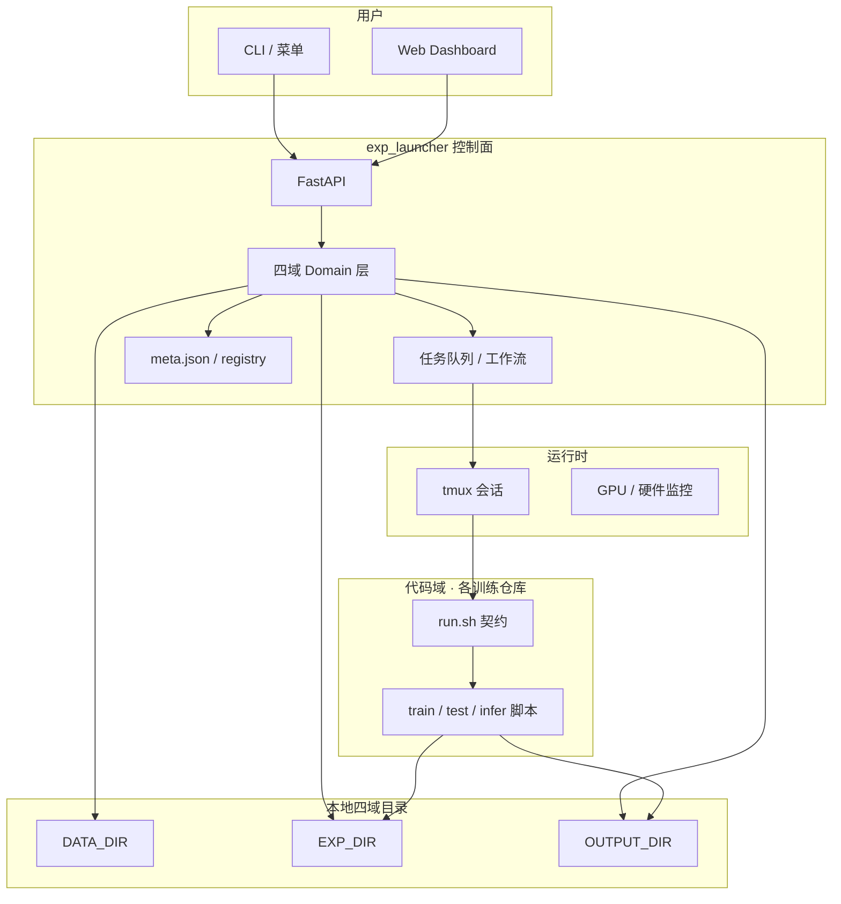

**exp_launcher 是面向单机 / 小团队的 ML 实验编排层**：不实现训练算法本身，而是把数据、代码、实验、交付四类资源串联起来，通过统一入口完成实验的启动、记录、复现与管理。

---
## 灵感与定位

项目灵感来自**大型互联网公司内部的 ML 训练平台**：在集群上用 K8s 等基础设施统一提交任务、管理模型版本、追踪实验 lineage。

**exp_launcher 做的是同一类问题的「轻量版」**——

| 维度 | 企业 K8s ML 平台 | exp_launcher |
|------|------------------|--------------|
| 部署形态 | 多机集群、容器化 | 单机 / 工作站、本地目录 |
| 任务调度 | Pod / Job、资源配额 | tmux + GPU 任务队列 |
| 环境隔离 | 镜像、Namespace | conda + git checkout |
| 状态存储 | 数据库、对象存储 | 文件系统 + `meta.json` |
| 仓库接入 | 训练镜像、Pipeline YAML | `run.sh` + `capabilities` JSON |
| 适用场景 | 团队规模化 MLOps | 个人 / 小团队 GPU 研究 |

可以概括为：

> **企业平台解决「集群上规模化跑实验」；exp_launcher 解决「研究机上把实验管清楚、跑起来、能复现」。**

它是 **filesystem-native 的轻量实验控制面（control plane）**，用目录约定与契约接口，把原先散落在各 repo bash 脚本里的 infra 抽成通用层。

---

## 五个核心概念

### 1. 编排层，而非训练框架

Launcher 是 **控制面**，不负责 forward / backward。一次启动的流程大致为：

1. 从 registry 解析模型锚点（repo + branch + commit）
2. `git checkout` 到指定版本，补齐 `run.sh` infra
3. 校验数据域 datasplit 与 processed 产物
4. 合并超参，组装 `run.sh` 命令行参数
5. 在 tmux 中后台执行，tee 日志，写入 / 更新 `meta.json`

训练、测试、推理的具体逻辑由各仓库的 `run.sh` 转发到 `train.py` / `segmentation.py` 等脚本。

### 2. 四域架构

将 ML 工作流拆为四个根目录，职责边界清晰：

```
┌──────────────────────────────────────────────────────────────────┐
│                        exp_launcher                               │
│  注册表 · 路径规划 · meta.json · CLI/Web · tmux · 任务队列         │
└───────┬──────────────┬──────────────┬──────────────┬─────────────┘
        ▼              ▼              ▼              ▼
   $DATA_DIR      $REPO_DIR      $EXP_DIR     $OUTPUT_DIR
   数据域          代码域          实验域          产品域
```

| 域 | 环境变量 | 平台类比 | 典型内容 |
|----|----------|----------|----------|
| 数据域 | `DATA_DIR` | Dataset Registry | datasplit、预处理产物、preprocess 日志 |
| 代码域 | `REPO_DIR` | Model Registry + Git | 仓库工作副本、`models.tsv`、pinned commit |
| 实验域 | `EXP_DIR` | Experiment Tracking | checkpoint、TensorBoard、指标、`meta.json`、训练日志 |
| 产品域 | `OUTPUT_DIR` | Serving / 交付产出 | infer 可视化、PLY/STP、报告、manifest |

**边界原则：**

- 训练学得怎样 → **实验域**
- 拿 checkpoint 做推理交付 → **产品域**
- 数据划分与预处理状态 → **数据域**（launcher 权威管理 datasplit）
- 代码版本与 checkout → **代码域**（launcher 权威管理 registry）

### 3. 契约式仓库接入

各训练仓库只需实现统一插件接口，无需改 launcher 源码：

| 契约 | 作用 |
|------|------|
| `./run.sh <mode>` | 唯一执行入口（train / test / infer / preprocess / …） |
| `./run.sh capabilities` | 声明支持的 mode、dataset、task、可编辑超参 |
| `models.tsv` | 登记模型 entry：id、branch、commit、默认 tag |

Launcher 通过 capabilities 探测能力、校验 launch 请求，并按 mode 过滤传给 `run.sh` 的参数（例如 test 不传 train 专用超参）。

这相当于企业平台里的 **「训练镜像 + 任务模板」**，但更轻：不打 Docker、不写 K8s YAML，bash 即接口。

### 4. 可复现的实验记录

每次 run 由 launcher 维护 `meta.json`，记录：

- 代码：`entry_id`、`branch`、`commit`、`dirty` 标志
- 数据：`dataset_id`、`datasplit_path`、`datasplit_sha256`
- 实验：tag、date、`launch_mode`（train / test / resume / …）
- 环境：GPU、conda env、tmux session、hostname
- 路径：log、tensorboard、output 目录

模型在 `models.tsv` 中登记为 **「entry = repo + branch + commit」** 锚点。  
对应大平台中的 **实验 lineage / 可追溯性**——能回答「这个结果是用哪版代码、哪份数据、什么配置跑出来的」。

### 5. 统一人机入口

CLI 菜单、`exp_launcher run`、Web Dashboard（`exp_launcher web`）共用同一套 domain 逻辑与 API：

- **预览确认**：启动前展示合并后的超参、路径、checkpoint 策略
- **实验列表**：按 dataset / repo / mode 浏览历史 run
- **任务队列**：同 GPU 上串行排队，支持多步工作流（train → test → infer）
- **日志 tail**：WebSocket 实时查看 run 日志

类似企业平台的 **任务提交 UI + OpenAPI**，但默认跑在本机 `127.0.0.1:8765`，面向研究者而非多租户运维。

---

## 架构示意



---

## 当前能力一览

| 能力 | 说明 |
|------|------|
| 多 mode 启动 | train、resume、test、infer、preprocess 等（由 repo capabilities 决定） |
| 模型 registry | `models.tsv` + git 锚点，支持多 repo、多 entry |
| 超参合并 | run.sh 默认值 ← capabilities ← registry notes ← 用户覆盖 |
| 进程管理 | tmux 后台、attach / kill 命令写入 meta |
| GPU 队列 | 同卡任务自动排队，避免冲突 |
| 工作流 | 多步编排（如 train 完成后自动 test） |
| Web UI | 实验列表、预览、提交、队列面板、日志流 |
| 可复现元数据 | `meta.json` + datasplit 哈希 + commit pin |

---

