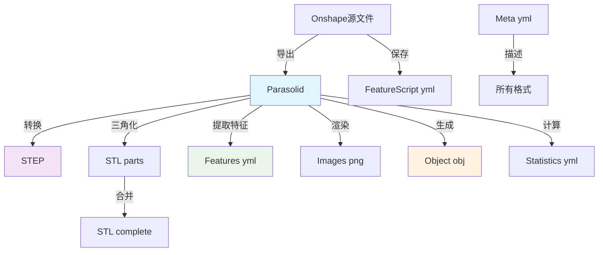

## 1. Meta (yml)
**数据结构**：YAML格式的元数据文档
```yaml
author: "设计者姓名"
creation_date: "2023-01-15"
document_id: "abc123xyz"
license: "CC BY 4.0"
units: "millimeters"
description: "机械零件装配体"
tags: ["bracket", "mechanical", "assembly"]
```

**用途**：
- 模型溯源和版权管理
- 数据集的版本控制和文档记录
- 为机器学习提供上下文信息
- 便于数据集的索引和搜索

---

## 2. Step (txt)
**数据结构**：STEP（ISO 10303）标准文件，ASCII文本格式
- 基于边界表示（B-rep）的精确几何
- 包含实体、面、边、顶点的拓扑结构
- 支持参数曲线和曲面（NURBS等）

**用途**：
- **CAD系统间交换**：工业标准，几乎所有CAD软件都支持
- **制造接口**：数控编程、3D打印切片
- **几何精度保持**：不损失精度，适合工程分析
- **特征保持**：保持原始设计特征

**示例内容结构**：
```
ISO-10303-21;
HEADER;
FILE_DESCRIPTION(('AP214'),'1');
FILE_NAME('model.step','2023-01-15',('author'),('organization'),'','','');
ENDSEC;
DATA;
#1 = CARTESIAN_POINT('',(0.,0.,0.));
#2 = DIRECTION('',(0.,0.,1.));
#3 = PLANE('',#1,#2);
...
ENDSEC;
END-ISO-10303-21;
```

---

## 3. Parasolid (zip)
**数据结构**：Parasolid内核原生格式，通常是压缩文件
- Parasolid是西门子的几何内核，被SolidWorks、NX、Solid Edge等使用
- 包含完整的B-rep信息，比STEP更紧凑
- 二进制或文本格式

**用途**：
- **原始CAD数据**：从Onshape导出（Onshape使用Parasolid内核）
- **高性能几何操作**：Parasolid内核的直接输入
- **版本存档**：保持最大程度的原始信息
- **内核级处理**：进行布尔运算、特征识别等底层操作

---

## 4. Stl parts (7z)
**数据结构**：每个零件单独的STL文件，打包为7z压缩包
- 三角网格表示，每个文件一个零件
- 顶点坐标和三角形面片索引
- ASCII或二进制格式

**用途**：
- **3D打印准备**：每个零件可以单独打印
- **零件级分析**：对单个部件进行有限元分析
- **装配体处理**：保持装配关系
- **轻量化可视化**：快速加载单个零件

**文件结构**：
```
assembly.7z
├── part1.stl
├── part2.stl
├── part3.stl
└── assembly.xml  # 可能的装配关系
```

---

## 5. Stl complete (stl2, binary)
**数据结构**：合并所有零件为单一STL文件的二进制格式
- 所有零件合并为一个水密网格
- 二进制格式，文件较小
- 但三角形质量可能不佳（可能有狭长三角形）

**用途**：
- **快速渲染**：游戏、实时可视化
- **统一处理**：整个模型作为一个实体处理
- **简化流程**：避免处理多个文件
- **体积分析**：计算整体体积、质心等

---

## 6. Features (yml)
**数据结构**：YAML格式的特征描述文件
```yaml
features:
  - type: "plane"
    face_indices: [0, 1, 2, 3]
    parameters:
      normal: [0, 0, 1]
      point: [0, 0, 0]
  - type: "cylinder"
    face_indices: [4, 5]
    parameters:
      axis: [1, 0, 0]
      radius: 5.0
  - type: "fillet"
    edge_indices: [10, 11, 12]
    parameters:
      radius: 2.0
```

**用途**：
- **机器学习标注**：监督学习的ground truth
- **特征识别研究**：评估特征识别算法
- **参数化设计**：记录设计意图
- **制造规划**：识别加工特征（孔、倒角、凸台等）

---

## 7. Object (obj, txt)
**数据结构**：Wavefront OBJ格式，带额外属性
```
v 0.0 0.0 0.0
v 1.0 0.0 0.0
v 0.0 1.0 0.0
vn 0.0 0.0 1.0
vn 0.0 0.0 1.0
vn 0.0 0.0 1.0
# 可能包含曲率
c 0.1
c 0.2
c 0.15
f 1//1 2//2 3//3
```

**包含信息**：
- 顶点坐标 (v)
- 纹理坐标 (vt, 如果有)
- 法线向量 (vn, 地面真实法线)
- 曲率值 (c, 每个顶点)
- 面片索引 (f, 与features文件对应)

**用途**：
- **计算机图形学研究**：标准格式，易于处理
- **渲染测试**：带真实法线，渲染质量高
- **几何处理算法**：网格简化、细分、参数化
- **机器学习输入**：深度学习模型的输入数据

---

## 8. Images (png)
**数据结构**：从标准视角渲染的PNG图像
- 多视角渲染（等轴测、前、上、右等）
- 可能包含不同的光照条件
- 可能包含深度图、法线贴图等通道

**典型视角**：
1. 等轴测视图
2. 前视图、后视图
3. 左视图、右视图
4. 顶视图、底视图

**用途**：
- **基于图像的检索**：通过图片搜索CAD模型
- **多模态学习**：连接几何和图像信息
- **可视化验证**：快速检查模型质量
- **神经网络训练**：2D卷积神经网络的输入

---

## 9. Statistics (yml)
**数据结构**：模型统计信息的YAML文件
```yaml
cad_statistics:
  num_faces: 25
  num_edges: 60
  num_vertices: 36
  num_solids: 1
  bounding_box: [100.0, 50.0, 25.0]
  volume: 12500.0
  surface_area: 3500.0

mesh_statistics:
  num_vertices: 50000
  num_faces: 100000
  average_edge_length: 0.5
  min_edge_length: 0.01
  max_edge_length: 5.0
  triangle_quality: 0.85
  is_watertight: true
  is_manifold: true
```

**用途**：
- **数据质量评估**：验证模型是否合理
- **数据集平衡**：确保数据集中各种复杂度模型都有
- **算法性能分析**：不同复杂度模型的运行时间
- **预处理决策**：决定网格简化程度

---

## 10. FeatureScript (yml)
**数据结构**：Onshape FeatureScript的YAML表示
```yaml
features:
  - type: "sketch"
    parameters:
      plane: "front"
      geometry: [...]
  - type: "extrude"
    parameters:
      depth: 10.0
      operation: "new"
  - type: "fillet"
    parameters:
      edges: [...]
      radius: 2.0
  - type: "hole"
    parameters:
      diameter: 5.0
      depth: "through_all"
```

**用途**：
- **设计历史重放**：重建建模过程
- **参数化研究**：分析设计模式和约束
- **生成式设计**：学习设计规律
- **设计自动化**：自动生成类似设计

---

## 数据流转关系


---

## 应用场景对应表

| 应用场景 | 推荐使用格式 | 原因 |
|---------|-------------|------|
| **CAD系统编辑** | STEP, Parasolid | 保持精确几何，支持参数编辑 |
| **3D打印** | STL complete | 单个水密网格，切片软件支持 |
| **有限元分析** | STL parts → 重新网格化 | 可控制各零件网格质量 |
| **机器学习训练** | Object + Features | 有标注的几何和特征信息 |
| **神经网络渲染** | Images | 标准2D输入格式 |
| **几何处理研究** | Object | 带法线和曲率的网格 |
| **特征识别评估** | Features | Ground truth特征 |
| **参数化设计研究** | FeatureScript | 建模过程记录 |
| **数据集管理** | Meta, Statistics | 元数据和统计信息 |

---

## 格式转换注意事项

1. **索引对应**：Features文件(0-index)和Object文件(1-index)的顶点索引需要转换
2. **精度损失**：Parasolid/STEP到STL/OBJ会有三角化精度损失
3. **特征保持**：B-rep到网格转换可能丢失精确特征（如完美圆柱）
4. **数据一致性**：所有派生格式应与原始CAD在几何上一致

这个数据集的设计非常完整，覆盖了从精确CAD到各种应用格式的全链条，特别适合CAD/CG交叉研究、几何处理算法开发和机器学习研究。
