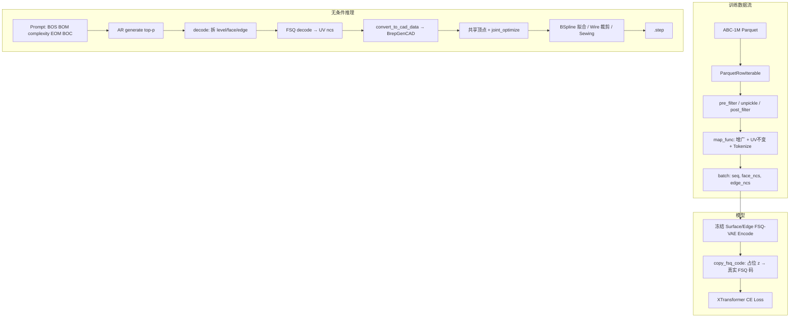
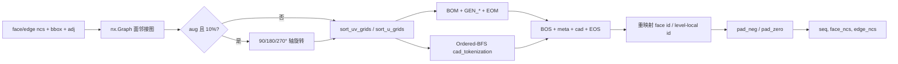
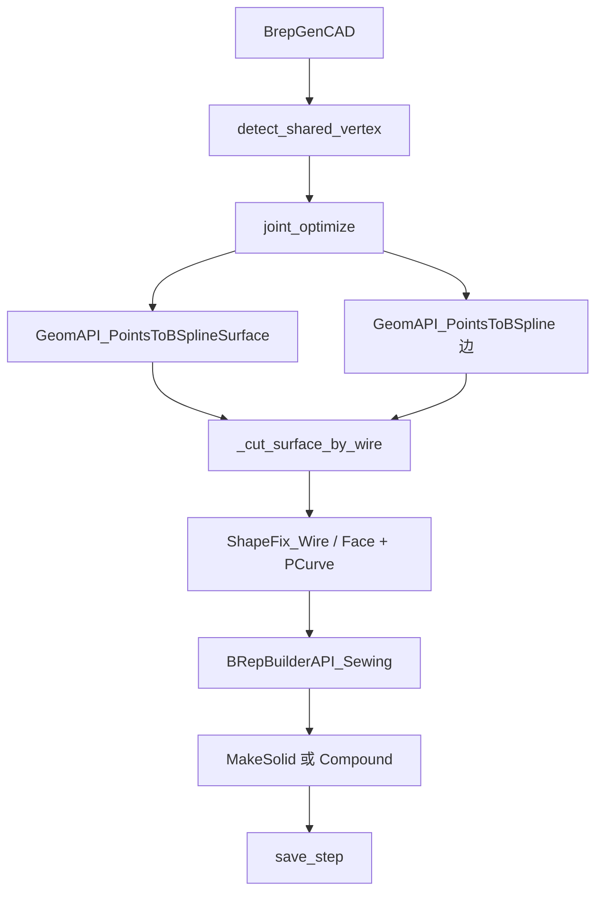

# AutoBrep 数据流与算子详解

> 仓库：`/home/divisor/workspace/repo/AutoBrep`  
> 论文：*AutoBrep: Autoregressive B-Rep Generation with Unified Topology and Geometry* (SIGGRAPH Asia 2025)  
> 本文基于当前代码实现梳理 **训练数据流**、**模型前向**、**推理重建**，并枚举主要算子。

---

## 1. 总览

AutoBrep 把 CAD **B-Rep** 统一编码为一条离散 token 序列，用 **decoder-only Transformer** 自回归生成；几何细节由预训练 **面 / 边 FSQ-VAE** 编解码 UV 点阵；推理时把 token 解析回 bbox + UV，再经联合优化与 OpenCASCADE 缝合成 STEP 实体。



| 阶段 | 核心产物 | 入口 |
|------|----------|------|
| 数据 | `seq` + `face_ncs` + `edge_ncs` | `ARDataModule` |
| 训练 | next-token CE | `AutoBrepModel.common_step` |
| 采样 | token 序列 | `AutoRegressiveSampler.sample_tokens` |
| 解码 | bbox + FSQ 码 + 邻接 | `AutoBrepModel.decode` |
| 几何 | UV / WCS 点阵 | Surface/Edge FSQ decode + `convert_to_cad_data` |
| 重建 | OCC Solid / Compound | `AutoBrepBuilder.rebuild_brep` |
| 交付 | STEP | `occwl.io.save_step` / `infer_pipeline` |

---

## 2. 离散词表与 Token 布局

### 2.1 特殊控制符 `MMTokenIndex`

定义于 `core/src/autobrep/data/token_mapping.py`：

| ID    | 名称                         | 含义                               |
| ----- | -------------------------- | -------------------------------- |
| 0     | `BOS`                      | 序列开始                             |
| 1     | `EOS`                      | 序列结束（生成停止）                       |
| 2–3   | `BOT` / `EOT`              | 文本句（预留，当前主路径未用）                  |
| 4–5   | `BOC` / `EOC`              | CAD B-Rep 块开始 / 结束               |
| 6–7   | `BOL` / `EOL`              | **BFS 一层（level）** 开始 / 结束        |
| 8–9   | `BOF` / `EOF`              | 单个 **Face** 开始 / 结束              |
| 10–11 | `BOGEOM` / `EOGEOM`        | 用户几何条件块（autocomplete，可选）         |
| 12–13 | `BOM` / `EOM`              | Meta（复杂度）块                       |
| 14–17 | `GEN_EASY/MID/HARD/UNCOND` | 复杂度条件：面数 `<25 / <50 / ≥50 / 无条件` |
| 18–19 | `BOPC` / `EOPC`            | 点云条件（TODO，主路径未接入）                |
| 20    | `DUMMYID`                  | 悬空边 / 用户输入占位                     |

`FLAG_PAD = len(MMTokenIndex) = 21`，其后是 **非控制** 离散值。

### 2.2 数值 Token 偏移（训练 / 解码共用）

设：

- `flag_pad = 21`
- `id_pad = max_face`（配置默认 **200**）
- `pos_pad = 2^bit`（`bit=10` → **1024**）
- `surf_codebook_size` / `edge_codebook_size`（配置默认各 **1000**）

则：

| 区间（逻辑） | 内容 |
|--------------|------|
| `[0, flag_pad)` | 控制符 |
| `[flag_pad, flag_pad + id_pad)` | **Face ID**（拓扑引用） |
| `[flag_pad+id_pad, face_z_pad)` | **bbox 坐标**（6 个数，各 `bit` bits 量化） |
| `face_z_pad = pos_pad + id_pad + flag_pad` | Face 几何 **占位索引**（训练时再换成 FSQ 码） |
| `edge_z_pad = face_z_pad + max_face` | Edge 几何占位索引起点 |
| FSQ 替换后 | Face：`face_z_pad + [0, surf_codebook)` 共 4 个码；Edge：再偏移 `surf_codebook`，共 2 个码 |

`AutoBrepModel` 词表大小：

```text
num_tokens = face_z_pad + surf_codebook_size + edge_codebook_size
```

（默认约 `21+200+1024 + 1000 + 1000 = 3245` 量级，具体以 `max_face/bit/codebook` 为准。）

### 2.3 单 Face 序列模板（CAD 块内）

有序 BFS 下，每个 face 大致为：

```text
BOF
  face_id
  face_bbox[6]          # 量化后的 min/max xyz
  face_z_placeholder    # → 训练时替换为 4× surface FSQ indices
  # 对每个「与先前已生成 face 共享」的 edge（按 edge bbox 字典序）：
    prev_face_id
    edge_bbox[6]
    edge_z_placeholder  # → 训练时替换为 2× edge FSQ indices
EOF
```

Level 用 `BOL` / `EOL` 分隔；整块 CAD 用 `BOC` … `EOC`。

无条件推理 prompt（5 token）：

```text
BOS  BOM  {GEN_*}  EOM  BOC
```

---

## 3. 训练数据流（Parquet → Batch）

### 3.1 数据源

- 数据集：HuggingFace `ADSKAILab/ABC-1M`（去重 ABC）
- 本地期望布局：`{data_root}/train|val/*.parquet`
- Lightning：`ARDataModule`（`configs/autobrep.yaml`）

**Parquet 列（核心）**

| 列名 | 含义 |
|------|------|
| `face_points_normalized` | 面 UV 点阵（NCS），序列化为 bytes |
| `edge_points_normalized` | 边 U 点阵（NCS） |
| `face_bbox_world` | 面世界坐标 bbox，形状约 `(F, 6)` = minxyz∥maxxyz |
| `edge_bbox_world` | 边世界坐标 bbox `(E, 6)` |
| `face_edge_incidence` | 面–边邻接布尔矩阵 `(F, E)`，流形边列和应为 2 |
| `num_faces_after_splitting` | pushdown 过滤 |
| `scaled_unique` | 去重标记（可选） |
| `constraint_faces` | 可选，几何条件 mask |

### 3.2 流式 Pipeline 算子

`ParquetRowIterable`（`abc_data.py`）：

```text
scanner(parquet)
  → pre_filter(row)          # 未反序列化前的快速拒样（实际主过滤在 unpickle 后）
  → unpickle(row)            # deserialize_array → ndarray
  → post_filter(row)         # 默认 True；AR 主过滤在 pre_filter 内对反序列化字段检查
  → map_func(row, aug=...)   # 增广 + tokenize
  → [可选] shuffle buffer
  → DataLoader collate
```

> 实现细节：`ARDataModule.pre_filter` 内部已对 `face_edge_incidence` 等做 `deserialize_array`，即过滤发生在「逻辑行」上。

### 3.3 `pre_filter` 拒样条件

| 检查 | 说明 |
|------|------|
| 空邻接 / 0 维邻接 | 非法拓扑 |
| 某 face 无边 | `all(~adj, axis=1)` |
| 非流形 | `adj.sum(0) != 2` 存在 |
| 边数 `> max_edge` | 默认 1000 |
| 极小面 / 极小边 | bbox 三轴差均 `< 1/2^(bit-1)` |
| 简单样本降采样 | `num_faces < 25` 时约 90% 丢弃 |

### 3.4 `map_func`：从几何到 `seq`



#### 3.4.1 增广算子 `argument_cad_data`

- `bbox_corners` → 随机轴 × `{90,180,270}` 旋转（`rotate_axis`）
- 同步旋转 face/edge NCS 点阵
- `get_bboxes` 重算 AABB

#### 3.4.2 UV 不变性

- `utils.sort_uv_grids`：面网格规范朝向
- `utils.sort_u_grids`：边折线规范方向  

须在旋转增广之后执行。

#### 3.4.3 Meta 复杂度（`load_meta=True`）

- 以 `meta_ratio`（默认 0.8）概率写入真实复杂度，否则 `GEN_UNCOND`
- 规则：面数 `<25` easy；`<50` mid；否则 hard

#### 3.4.4 Ordered-BFS `cad_tokenization`

1. `quantize_pos(face_pos, edge_pos, bit)` → 整数 bbox  
2. 按 face bbox 六元组 **lexsort** 得全局 `xyz_order`  
3. 以最小 xyz 面为起点（或续写 `seen_faces`），按面邻接图做 BFS：每层邻居再按 `xyz_order` 排序 → `faces_sorted` + `levels`  
4. `convert2seq`：按层输出 `BOL…EOL`，面内挂载「与已生成面共享的边」  

几何条件 `geom_tokenization`（`load_geom`）可先输出 `BOGEOM…EOGEOM` 与部分 face；当前 `map_func` 中 **geom_tokens 拼进 full_seq 被注释掉**，但 `seen_faces` 仍可影响 CAD 续写逻辑。

#### 3.4.5 Batch 字段

| 字段 | dtype | 形状（配置默认） |
|------|-------|------------------|
| `seq` | int64 | `(B, max_seq=3000)`，不足处 pad `-1` |
| `face_ncs` | float32 | `(B, max_face, U, V, 3)` |
| `edge_ncs` | float32 | `(B, max_edge, U, 3)` |

---

## 4. 几何 Tokenizer：FSQ-VAE 算子

几何 **不** 直接进 Transformer 连续特征；训练时用冻结 VAE 把 UV 编成离散码，写入序列中的几何槽位。

### 4.1 `FSQ`（`models/fsq.py`）

Finite Scalar Quantization：

- 输入连续 latent → `bound` + `round_ste` → 量化向量 + code index  
- 默认 levels 示例 `[8,5,5,5]` → codebook size `8×5×5×5 = 1000`（与 yaml 中 codebook_size 对齐）  
- `indices_to_codes`：推理解码用

### 4.2 `SurfaceFSQVAE`

| 子算子 | 作用 |
|--------|------|
| `Encoder` / `DCEncoder`（2D） | 面 UV `(B,3,U,V)` → latent |
| `downsample` Conv2d | 空间再压缩 |
| `FSQ` | → quant + indices |
| `upsample` Linear + `Decoder` / `DCDecoder` | 重建 UV |
| Loss | 点坐标 MSE |

- `encode(x)` → `(quant, id)`；`id` 展平后为 **4** 个 surface code（与 decode 中 `x[7:11]` 一致）  
- 推理：`drop_encoder()`，仅用 `indices_to_codes` + `decode`

### 4.3 `EdgeFSQVAE`

| 子算子 | 作用 |
|--------|------|
| `Encoder1D` / `DCEncoder1D` | 边折线 `(B,3,U)` |
| `downsample` Conv1d + `FSQ` | 量化 |
| `Decoder1D` / `DCDecoder1D` | 重建 |

- Edge FSQ 码长度为 **2**（decode 中 `x[6:8]`）

### 4.4 训练时注入：`encode_fsq_code` + `copy_fsq_code`

1. `face_ncs` / `edge_ncs` → 冻结 VAE → `surf_id (B,F,4)`、`edge_id (B,E,2)`  
2. 扫描 `seq` 中几何占位 token：  
   - face z 槽 → 换成 `surf_id[face] + face_z_pad`（展开为 4 token）  
   - edge z 槽 → 换成 `edge_id[edge] + face_z_pad + surf_codebook`（2 token）  
3. pad 到 `max_seq`，`-1` 忽略  

---

## 5. 自回归主干算子

### 5.1 `XTransformer`（`network.py`）

基于 `x_transformers`：

- `TransformerWrapper` + `AutoregressiveWrapper`  
- Decoder：`depth/heads/dim/kv_groups`（yaml 默认 depth=16, heads=32, dim=2048, kv_groups=8）  
- Rotary PE、Flash Attention、GLU FFN、L2-norm embed  
- `forward`：对 `x[:,1:]` 做 **CrossEntropy**，`ignore_index=-1`  
- 可选 `cond_mask`：前 4 个条件 token 不计 loss（meta prompt）  
- 可选 level dropout attention mask（代码中构造后当前调用传 `attn_mask=None`）

### 5.2 `AutoBrepModel`

| 方法 | 角色 |
|------|------|
| `common_step` | 训练一步：FSQ 注入 + CE |
| `generate` | `ar_decoder.generate`，`eos=EOS`，`filter_logits_fn=top_p` |
| `decode` | token → `pos_faces, geomCode_faces, pos_edges, geomCode_edges, face_edge_adj` |

优化器：AdamW（`lr=2e-4`, `weight_decay=0.05`, `betas=(0.9,0.95)`）。

### 5.3 采样配置算子（`autoregressive_samplers.py`）

Pydantic 描述：`TopP` / `TopK` / `TopA` / `MinP`；推理入口实际走 `x_transformers` 的 `top_p`。

### 5.4 为何同一 5-token prompt 能生成不同 B-Rep？

**不是** prompt 里某个 token 的 embedding 被随机采样。那 5 个 id（`BOS BOM GEN_* EOM BOC`）查表得到的 embedding 是确定的。

多样性来自 **自回归续写时逐步随机抽下一个 token**。`AutoBrepModel.generate` 调用 `x_transformers.AutoregressiveWrapper.generate`：

1. 模型对词表输出 logits；
2. `filter_logits_fn = top_p(thres=...)`：只保留累积概率达到阈值的头部候选；
3. `softmax(logits / temperature)` 得到分布；
4. **`torch.multinomial(probs, 1)`** 按概率抽取下一个 token（非 `argmax`）。

对应库内逻辑（`temperature != 0` 时）：

```text
filtered = top_p(logits)
probs = softmax(filtered / temperature)
next_token = multinomial(probs, 1)
```

因此：

| 设置 | 行为 |
|------|------|
| 默认 `temperature=1.0`, `top_p=0.9` | 同 prompt 多次运行 → 不同序列 → 不同 B-Rep |
| `temperature=0` | greedy（`argmax`），同 prompt 基本固定 |
| `use_seed=true` + 固定 seed | 抽样可复现 |
| `complexity=random` | prompt 中 `GEN_*` 本身也可能变，额外引入差异 |

无条件生成学的是先验 $p(\text{seq})$；固定前缀下每一步仍从 $p(t_{k+1}\mid t_{\le k})$ **采样**，而不是确定性解码。

---

## 6. 推理数据流（Token → STEP）

入口：

- 原生：`python -m autobrep.inference.sample_ar`  
- exp_launcher：`scripts/infer_pipeline.py` ← `run.sh infer`

### 6.1 阶段 A：采样

`AutoRegressiveSampler.sample_tokens`：

1. 映射 complexity → `GEN_*` id（`random`→17 UNCOND）  
2. 构造 prompt `(B,5)`  
3. `AutoBrepModel.generate` → 续写至 `max_seq` 或 `EOS`  
4. `concat(prompt, samples)`

### 6.2 阶段 B：Token 解析 `decode`

对单个样本（去掉 ≤0 的 pad）：

1. 按 `BOL` 切 level，再按 `BOF` 切 face  
2. 每个 face：`tokens[1:7]` → face bbox 整数；`[7:11]` → 4× surface FSQ  
3. 后续每 8 元组：`prev_face_id + edge_bbox[6] + edge_codes[2]`  
4. `dequantize(..., bit, [-1,1])` 得连续 bbox  
5. 由 `(cur_face, prev_face)` 边对填 `face_edge_adj (F,E)`

### 6.3 阶段 C：FSQ 解码 UV

- Surface：`indices_to_codes` → `unflatten(2,2)` → `surface_fsq.decode` → `face_ncs (F, U, V, 3)`  
- Edge：`indices_to_codes` → `edge_fsq.decode` → `edge_ncs (E, U, 3)`

### 6.4 阶段 D：`convert_to_cad_data` → `BrepGenCAD`

| 字段 | 含义 |
|------|------|
| `face_pos_cad` | 面 bbox `(F,6)` |
| `edge_pos_cad` | 边 bbox `(E,6)` |
| `face_ncs_cad` / `edge_ncs_cad` | 归一化点阵 |
| `edge_mask_cad` | `~face_edge_adj` |
| `*_legacy` | Face×Edge 稠密布局 + `vertex_cad_legacy`（边端点）供后处理 |

NCS→WCS：`center, size = compute_bbox_center_and_size`；`wcs = ncs * (size/2) + center`。

### 6.5 阶段 E：后处理与 OCC 重建（`AutoBrepBuilder`）



| 算子 | 文件 | 输入 → 输出 |
|------|------|-------------|
| `AutoBrepPostProcess.compute_shared_vertex` | `post_process.py` | legacy 顶点 + 邻接 → 唯一顶点、边–顶点邻接 |
| `detect_shared_vertex` | `utils.py` | 距离阈值合并顶点 |
| `joint_optimize` | `utils.py` | 对齐面边到共享顶点（梯度优化；`eval_mode` 可旁路） |
| `rebuild_surfaces` | `brepgen_brep_builder.py` | face WCS UV → BSpline 曲面 |
| `rebuild_curves` | 同上 | edge WCS → BSpline 曲线（精度回退 5e-3→8e-3→5e-2） |
| `linker` | 同上 | 角点邻接 → 内外环顺序 |
| `_cut_surface_by_wire` | 同上 | 曲面 + Wire → 裁剪 Face |
| `fix_wires` / `fix_face` / `add_pcurves_to_edges` | OCC ShapeFix | 修复拓扑与 pcurve |
| `rebuild_solid` / Sewing | OCC | Face 集合 → Shell → Solid |
| `reconstruct_compound` | `inference_common.py` | 依次尝试 builders |
| `save_step` | occwl | 写出 `.step` |

推理超参（`sample.json` / launcher）：

| 参数 | 作用 |
|------|------|
| `complexity` | 条件 token |
| `temperature` / `top_p` | AR 采样 |
| `vertex_threshold` | 共享顶点距离 |
| `sewing_tolerance` | Sewing 容差 |
| `z_threshold` | SimplePostProcess 边合并（AutoBrep 路径主要用 vertex） |
| `batch_size` / `num_batches` | 批量采样 |

---

## 7. 算子清单（按层）

### 7.1 数据 I/O

| 算子 | 位置 | 职责 |
|------|------|------|
| `serialize_array` / `deserialize_array` | `data/serialize.py` | ndarray ↔ parquet bytes |
| `ParquetRowIterable` | `data/abc_data.py` | 流式读 + filter + map + shuffle |
| `BaseDataModule` / `ARDataModule` | 同上 | Lightning DataModule |
| `SimplePointGridDataWriter/Reader` | `data/simple_point_grid_data_file.py` | 调试用点阵 npz |

### 7.2 几何 / 拓扑预处理工具（`utils.py`）

| 算子 | 职责 |
|------|------|
| `quantize` / `dequantize` / `quantize_pos` | bbox 离散化 |
| `bbox_corners` / `get_bboxes` / `compute_bbox_center_and_size` | AABB 变换 |
| `rotate_axis` / `rescale_bbox` / `translate_bbox` | 增广 |
| `sort_uv_grids` / `sort_u_grids` | UV 规范 |
| `ncs2wcs` / `batch_ncs2wcs` | 局部→世界 |
| `pad_zero` / `pad_neg` | batch 填充 |
| `detect_shared_vertex` / `detect_shared_edge` | 拓扑合并 |
| `joint_optimize` | 几何一致性优化 |
| `chamfer_distance*` / `hausdorff_distance*` | 评测距离（工具） |

### 7.3 Tokenize

| 算子 | 职责 |
|------|------|
| `MMTokenIndex` | 控制符枚举 |
| `cad_tokenization` / `convert2seq` | BFS + 面边序列 |
| `geom_tokenization` | 条件几何块 |
| `map_func` | 全流程组装 |

### 7.4 神经网络

| 算子 | 职责 |
|------|------|
| `FSQ` | 标量量化 codebook |
| `SurfaceFSQVAE` / `EdgeFSQVAE` | UV 编解码 |
| `Encoder1D` / `Decoder1D` / `DCEncoder1D` / `DCDecoder1D` | 边 VAE 骨干 |
| `Embedder` |（network 内通用嵌入） |
| `XTransformer` | AR Transformer + CE |
| `AutoBrepModel` | 训练 / generate / decode |
| `AutoRegressiveSampler` | 推理编排 + FSQ decode |
| `TopP/TopK/TopA/MinP` | 采样策略描述 |

### 7.5 重建 / 可视化 / 编排

| 算子 | 职责 |
|------|------|
| `BrepGenCAD` | 中间 CAD 数据结构 |
| `PostProcess` / `SimplePostProcess` / `AutoBrepPostProcess` | 顶点/边合并与优化 |
| `BrepGenBrepBuilder` / `AutoBrepBuilder` | OCC B-Rep 重建 |
| `PointGridVisualizer` | 调试图 |
| `sample_ar.main` / `infer_pipeline.main` | CLI / launcher 入口 |
| `train.py` | LightningCLI `fit` |

---

## 8. 训练 vs 推理对照

| 项目 | 训练 | 推理（当前默认） |
|------|------|------------------|
| 输入 | ABC parquet 真值几何 | 仅 complexity prompt |
| 几何码 | 在线 VAE encode 注入 | AR 直接生成 FSQ indices，再 VAE decode |
| AR 模型 | `cad_gpt` 可训练 | fp16 eval `generate` |
| 拓扑顺序 | Ordered-BFS 监督 | 模型自回归「学出」同构序列 |
| 输出 | CE loss | STEP + 可选 debug PNG/NPZ |
| Meta | 按面数打标 / UNCOND | 用户选 easy/medium/hard/random |

---

## 9. 默认超参速查（`configs/autobrep.yaml`）

| 项 | 值 |
|----|----|
| `max_face` / `max_edge` / `max_seq` | 200 / 1000 / 3000 |
| `bit` | 10 |
| `surf/edge_codebook_size` | 1000 |
| Transformer | depth 16, heads 32, dim 2048, kv_groups 8 |
| `load_meta` / `meta_ratio` | True / 0.8 |
| `load_geom` / `geom_ratio` | False / 0.0（条件几何默认关） |
| `uv_invariant` / `aug` | True / True |
| precision | bf16-mixed |

权重三件套：`ar.ckpt`、`surf-fsq.ckpt`、`edge-fsq.ckpt`。

---

## 10. 关键路径与文件索引

```text
core/src/autobrep/
├── data/
│   ├── abc_data.py              # Parquet → seq
│   ├── token_mapping.py         # MMTokenIndex
│   ├── serialize.py
│   └── simple_point_grid_data_file.py
├── models/
│   ├── fsq.py                   # FSQ
│   ├── vaes.py                  # Surface/Edge FSQ-VAE
│   ├── autoregressive.py       # AutoBrepModel + Sampler
│   ├── autoregressive_samplers.py
│   └── dataclass.py             # BrepGenCAD
├── network.py                   # XTransformer + 1D VAE blocks
├── inference/
│   ├── sample_ar.py
│   ├── inference_common.py
│   ├── post_process.py
│   └── brepgen_brep_builder.py  # OCC 重建
├── utils.py                     # 量化/增广/优化/距离
├── point_grid_visualizer.py
└── train.py
scripts/
├── train.sh
├── sample.sh
└── infer_pipeline.py            # exp_launcher infer
configs/
├── autobrep.yaml
└── sample.json
```

---

## 11. 小结

1. **数据流本质**：流形 B-Rep →（bbox 量化 + Ordered-BFS 拓扑序列 + FSQ 几何码）→ 单一离散序列。  
2. **训练算子链**：Parquet 过滤 → tokenize → 冻结 FSQ encode 填槽 → Transformer CE。  
3. **推理算子链**：条件 prompt → AR top-p → 解析邻接与码 → FSQ decode UV → 顶点合并与联合优化 → BSpline/Wire/Sewing → STEP。  
4. **关键「算子」类别**：序列化 I/O、拓扑 BFS/引用、bbox 量化、FSQ-VAE、Transformer AR、共享顶点与 `joint_optimize`、OCC 几何内核。


